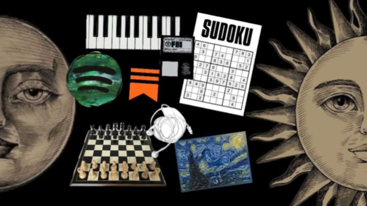

  

<h1 align="center">
  ─────── 🕯️ <code>MLQ</code> 🕯️ ───────
</h1>

  <i>"Every detail leaves a trace."</i> 
  كل تفصيل يترك أثرًا.

  ♟️ <b>Chess</b>
  &nbsp;•&nbsp;
  🎹 <b>Piano</b>
  &nbsp;•&nbsp;
  🧠 <b>Science</b>
  &nbsp;•&nbsp;
  🎨 <b>Art</b>
  &nbsp;•&nbsp;
  💻 <b>Programming</b>

  

 

  ───────── 🔎 <b>CASE FILE</b> 🔎 ─────────

<table align="center" width="88%">
  <tr>
    <td width="38%" align="center">
      
    </td>

<table> <tr> <td width="60%" valign="top"> <h3>🕵️ Subject: MLQ</h3> 
 <b>Status:</b> Investigating ideas.  <b>Location:</b> Somewhere between logic & imagination.  <b>Primary skill:</b> Asking inconvenient questions. 
 <ul> <li>🔎 <b>Observation:</b> Finding patterns hidden in ordinary things.</li> <li>♟️ <b>Strategy:</b> Thinking several moves ahead.</li> <li>🔬 <b>Analysis:</b> Breaking complex problems into simple pieces.</li> <li>🎨 <b>Creation:</b> Mixing logic with aesthetics.</li> <li>💻 <b>Investigation:</b> Learning programming one mystery at a time.</li> </ul> </td> <td width="40%" align="center" valign="middle">  </td> </tr> </table>

  </tr>
</table>

 

  ───────── 🗝️ <b>THE MIND</b> 🗝️ ─────────

  <i>
    "ليس كل ما هو غامض معقدًا، 
    أحيانًا نحن فقط لم نجد المفتاح بعد."
  </i>

  
    Not everything mysterious is complicated. 
    Sometimes, we simply haven't found the key yet.
  

 

  ───────── ⚔️ <b>TOOLS & WEAPONS</b> ⚔️ ─────────

  
  
  
  
  

 

  ───────── 📁 <b>CURRENT INVESTIGATION</b> 📁 ─────────

<table align="center">
  <tr>
    <td align="center" width="33%">
      <h3>💻</h3>
      <b>Programming</b> 
      Learning • Building • Experimenting
    </td>

<td align="center" width="33%">
  <h3>🎹</h3>
  <b>Piano</b> 
  Turning patterns into music
</td>

<td align="center" width="33%">
  <h3>🎨</h3>
  <b>Art</b> 
  Making logic look beautiful
</td>

  </tr>
</table>

 

  ───────── ♟️ <b>THINKING ROOM</b> ♟️ ─────────

  <i>
    "The interesting part isn't finding the answer. 
    It's discovering the question nobody thought to ask."
  </i>

  ─── 📄 <b>ACTIVITY REPORT</b> 📄 ───

  
  &nbsp;
  

<h3 align="center">📓 CASE INVESTIGATION: SECRET FILE 📓</h3>

<table>
  <tr>
    <td width="30%" align="center" valign="middle">
      
    </td>
    <td width="70%" valign="top">
      <h3>📁 FBI CONFIDENTIAL DOSSIER</h3>
      

        <b>SUBJECT CODE:</b> <code>L-09</code> 
        <b>CLEARANCE:</b> LEVEL 5 ONLY 
        <b>CLASSIFICATION:</b> TOP SECRET INVESTIGATION
      

      <ul>
        <li>🖋️ <b>Notebook Entries:</b> Documenting patterns, code & anomalies.</li>
        <li>☕ <b>Fuel Source:</b> Pure logic & excessive sugar/coffee.</li>
        <li>🔎 <b>Deduction Rate:</b> 99.8% accurate under pressure.</li>
      </ul>
      
<i>"I have two rules: First, I'm never wrong. Second, if I'm wrong, back to rule number one."</i>

    </td>
  </tr>
</table>

 

  <b>📊 INVESTIGATION PRODUCTIVITY GRID (WORK ACTIVITY)</b>

 

 

  <b>🌸 ABILITY & SKILL RADAR MATRIX 🌸</b>

<table width="100%" align="center">
  <tr>
    <td width="50%" valign="top">
      <h4>🔍 DEDUCTION & ANALYTICS</h4>
      <b>Logic & Reasoning</b>
       
      
        
      <b>Code Architecture</b>
       
      
    </td>
    <td width="50%" valign="top">
      <h4>💻 TECH STACK & TOOLS</h4>
      <b>Problem Solving</b>
       
      
        
      <b>Investigation Speed</b>
       
      
    </td>
  </tr>
</table>

 

                                                                                                                                                                                                                                                 
  ───────── 🕯️ <b>FINAL NOTE</b> 🕯️ ─────────

  <i>
    "The truth is usually hidden in the details."
  </i>
   
  الحقيقة غالبًا تختبئ في التفاصيل.

  ♟️ ───────────────────────────── ♟️

  
    Case status: <b>OPEN</b> • Investigation ongoing...
  

